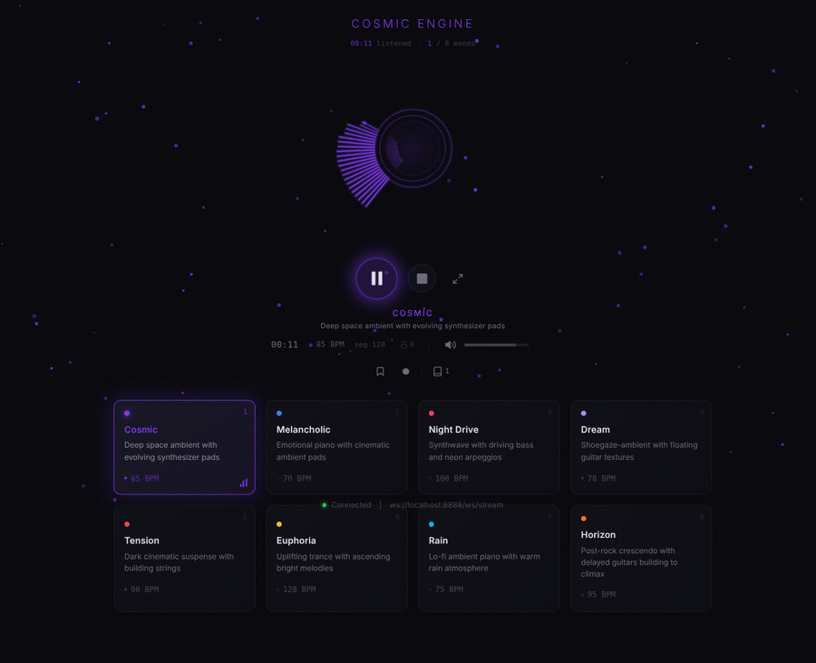

<div align="center">

# Cosmic Engine

### Infinite music from a neural network that learned to feel.

Pick a mood. Press play. Listen forever.

<br/>


<br/>



<br/>
<br/>

A 35-million-parameter transformer trained on 178,000 songs generates MIDI sequences conditioned on emotion, synthesizes them through FluidSynth, and streams the result to your browser in real time. No loops. No samples. No two listens are the same.

</div>

---

## What this actually is

This is not a playlist. It is not procedural generation with random notes stitched together.

Cosmic Engine is a neural network that internalized the structure of music -- harmony, rhythm, tension, resolution -- from 178,000 MIDI files. When you select a mood, the model generates original compositions token by token, each informed by every token that came before it. The output is coherent, evolving, and endless.

You open a browser tab. You pick how you want to feel. The music begins and never stops.

---

## The signal path

```
Mood --> Transformer --> MIDI tokens --> FluidSynth --> WebSocket --> Your ears
```

1. **You choose an emotion.** Eight moods, each with its own temperature, guidance scale, BPM range, and harmonic profile. These aren't labels -- they are parameter regimes that shape what the model creates.

2. **The transformer writes music.** A GPT-2-style causal model with Rotary Positional Embeddings and mood conditioning autoregressively generates REMI-tokenized MIDI. Nucleus sampling with per-mood temperature controls the boundary between coherence and surprise.

3. **FluidSynth gives it a voice.** Raw token sequences decode back to MIDI events and render to 32kHz audio through General MIDI soundfonts. Convolution reverb adds space. Normalization and fade curves smooth the edges.

4. **Adaptive streaming keeps it seamless.** The backend measures its own generation speed and self-tunes segment duration (3--15 seconds) to stay ahead of playback. A pre-generation buffer works on the next segment while the current one plays. Segments overlap with a raised-cosine crossfade.

5. **Gapless playback in the browser.** Web Audio API schedules buffers with sample-accurate timing. A real-time frequency visualizer renders what you hear. No gaps. No clicks. No silence between thoughts.

---

## Moods

Each mood is a distinct emotional space with its own generation parameters.

| | Mood | BPM | Sound |
|-|------|-----|-------|
| | **Cosmic** | 85 | Deep space ambient -- evolving synthesizer pads drifting through void |
| | **Melancholic** | 70 | Emotional piano layered with cinematic ambient pads |
| | **Night Drive** | 100 | Synthwave -- driving bass and neon arpeggios on empty highways |
| | **Dream** | 78 | Shoegaze-ambient -- floating guitar textures dissolving into reverb |
| | **Tension** | 90 | Dark cinematic suspense -- strings building toward something |
| | **Euphoria** | 128 | Uplifting trance -- ascending bright melodies breaking through |
| | **Rain** | 75 | Lo-fi ambient piano -- warm and unhurried, like watching weather |
| | **Horizon** | 95 | Post-rock crescendo -- delayed guitars building to catharsis |

---

## Features

- **Endless generation** -- music that evolves and never loops back
- **8 mood presets** with distinct harmonic profiles, BPM, and generation parameters
- **4 swappable engines** -- mock (dev), MusicGen (local GPU), Replicate (cloud), MIDI Transformer (production)
- **Adaptive streaming** -- backend self-tunes segment length to prevent buffer underruns
- **Raised-cosine crossfade** -- smooth transitions between segments
- **Pre-generation buffer** -- next segment generates while the current one plays
- **Real-time visualizer** -- frequency spectrum analyzer that breathes with the music
- **Save and record** -- bookmark a moment or record a full session, stored in IndexedDB
- **Library panel** -- browse, replay, and manage everything you've saved
- **Seed control** -- lock a generation seed to reproduce a passage you loved
- **Immersive fullscreen** -- just the visualizer and the sound
- **Keyboard-driven** -- full shortcut support, hands never leave the keys
- **Dark by default** -- designed for ambient listening at 2am, not productivity dashboards

---

## The model

The MIDI Transformer is a GPT-2-style causal language model purpose-built for music.

| | |
|---|---|
| **Parameters** | ~35M |
| **Architecture** | 8 layers, 8 heads, 512 embedding dim, 2048 FFN |
| **Positional encoding** | Rotary (RoPE) |
| **Sequence length** | 1024 tokens |
| **Tokenization** | REMI (relative MIDI encoding) |
| **Mood conditioning** | Learned embedding added to token embeddings |
| **Sampling** | Top-k + nucleus (top-p) with per-mood temperature |
| **Training data** | Lakh MIDI Dataset (~178K files) |
| **Optimizer** | AdamW, cosine schedule, 1000-step warmup |
| **Attention** | PyTorch SDPA (FlashAttention when available) |
| **Weight tying** | Token embedding tied to LM head |

---

## Quick start

### Prerequisites

- Python 3.10+
- Node.js 18+
- FluidSynth + GM soundfont (for the MIDI Transformer engine)

```bash
# Ubuntu/Debian
sudo apt install fluidsynth fluid-soundfont-gm
```

### Backend

```bash
cd backend
python -m venv .venv && source .venv/bin/activate
pip install -r requirements.txt

# Mock engine -- no GPU, instant start, great for development
ENGINE_TYPE=mock python -m uvicorn app.main:app --host 0.0.0.0 --port 8888

# Or the real thing -- MIDI Transformer with a trained model
ENGINE_TYPE=midi_transformer MIDI_MODEL_DIR=./exported python -m uvicorn app.main:app --host 0.0.0.0 --port 8888
```

### Frontend

```bash
cd frontend
npm install && npm run dev
```

Open `http://localhost:5173`. Pick a mood. Press play. Disappear.

### Environment

| Variable | Default | What it does |
|----------|---------|--------------|
| `ENGINE_TYPE` | `mock` | `mock`, `musicgen`, `replicate`, `midi_transformer` |
| `MIDI_MODEL_DIR` | `./exported` | Path to exported model weights |
| `SOUNDFONT_PATH` | `/usr/share/sounds/sf2/FluidR3_GM.sf2` | FluidSynth soundfont |
| `SAMPLE_RATE` | `32000` | Audio sample rate (Hz) |
| `SEGMENT_DURATION` | `15.0` | Base segment length (seconds) |
| `CROSSFADE_DURATION` | `2.0` | Overlap between segments (seconds) |
| `PORT` | `8888` | Backend port |
| `DEVICE` | `auto` | PyTorch device: `auto`, `cpu`, `cuda` |
| `MODEL_NAME` | `facebook/musicgen-small` | HuggingFace model (MusicGen engine) |
| `REPLICATE_API_TOKEN` | -- | API key (Replicate engine only) |

---

## Keyboard shortcuts

| Key | Action |
|-----|--------|
| `Space` | Play / Pause / Resume |
| `Escape` | Stop |
| `1`--`8` | Jump to mood |
| `M` | Mute / Unmute |
| `Up` / `Down` | Volume |
| `F` | Fullscreen |
| `S` | Save clip |
| `R` | Record / Stop recording |
| `L` | Library |
| `?` | Help |

---

## Train your own

The full pipeline is included. You need a GPU with 16GB+ VRAM.

```bash
cd training
pip install -r requirements.txt

# Download and tokenize Lakh MIDI (~178K files)
python scripts/prepare_data.py

# Train (~35-40 hours on A4000)
python train.py

# Export for inference
python export_model.py --checkpoint checkpoints/best.pt --output ../backend/exported/
```

Training config lives in `training/configs/`. Defaults: batch size 16, lr 3e-4, cosine schedule, 1000-step warmup, checkpoints every 5K steps.

---

## Architecture

```
frontend/                    React + Vite + TypeScript
  src/
    hooks/
      useAudioStream          WebSocket client + Web Audio playback
      useKeyboardShortcuts    Keyboard handler
      useAudioRecorder        Rolling buffer save/record system
      useLibrary              IndexedDB storage layer
    components/
      Visualizer              Real-time frequency spectrum
      Transport               Playback controls, seed lock, status
      MoodSelector            Mood grid with live indicators
      SaveControls            Bookmark, record, library toggle
      Library                 Slide-out saved recordings panel
      ParticleBackground      Mood-reactive particle system

backend/                     FastAPI + Python
  app/
    config.py                Pydantic settings from environment
    moods.py                 8 mood presets with generation parameters
    engines/
      mock.py                Sine-wave test engine
      musicgen.py            Meta MusicGen (local GPU inference)
      replicate.py           Replicate API client
      midi_transformer.py    MIDI generation + FluidSynth synthesis

training/                    Full training pipeline
  model.py                   35M-param transformer (RoPE, mood conditioning)
  train.py                   Training loop (AdamW, cosine LR, gradient clipping)
  export_model.py            Export state dict + config + optional ONNX
  scripts/                   GPU setup, data download, automation
```

---

## Stack

**Frontend:** React, Vite, TypeScript, Web Audio API, IndexedDB

**Backend:** FastAPI, WebSocket, FluidSynth, NumPy/SciPy

**Model:** PyTorch, custom GPT-2 architecture, REMI tokenization

**Runs on:** CPU (mock / MIDI Transformer) or GPU (MusicGen). Cloud option via Replicate.

---

## License

MIT
